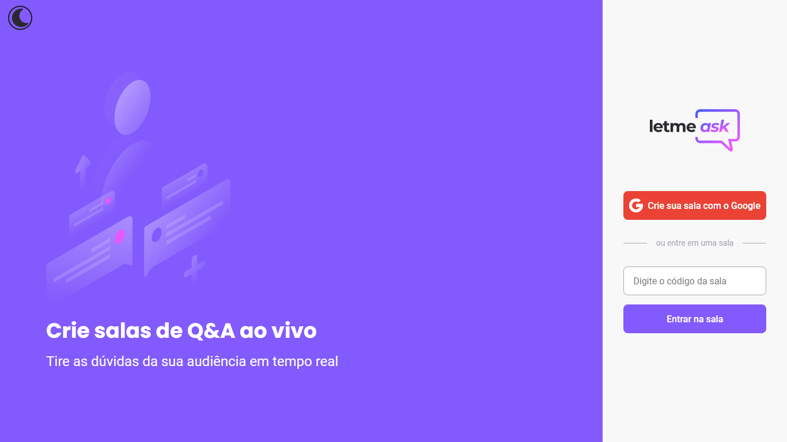
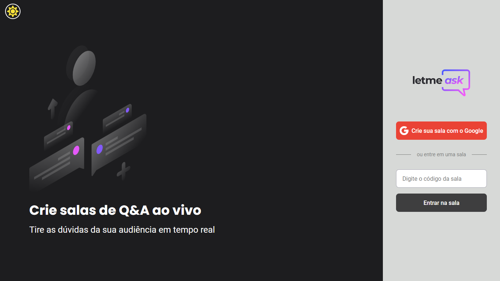

<p align="center">
  
</p>

<hr>

<h1 align="center">
    
</h1>

<h1 align="center">
    
</h1>

<hr>

## :memo: Project

Letmeask is perfect for content creators to create Q&A rooms with their audience in a very organized and democratic way.

This is a project developed during the **[Next Level Week Together](https://nextlevelweek.com/)**, presented from 20th to 27th of June 2021.

<hr>

## :computer: Technologies used

:pushpin: Typescript

:pushpin: React

:pushpin: Sass

:pushpin: Firebase

<hr>

## :rocket: How to use?

:heavy_check_mark: Clone project and access its folder.

```bash
$ git clone https://github.com/jtiagosantos/Letmeask.git
$ cd Letmeask
```

:heavy_check_mark: To start it, follow the steps below:

```bash
# Install dependencies
$ yarn

# Start project
$ yarn start
```

The app will be available in your browser at the address http://localhost:3000.

Remembering that you will need to create an account on [Firebase](https://firebase.google.com/) and a project to make a Realtime Database available.

<hr>

## 🔖 Layout

You can view the project layout through the link below:

- [Layout Web](https://www.figma.com/file/u0BQK8rCf2KgzcukdRRCWh/Letmeask/duplicate) 


## :cloud: App

You can access the application through the link below:

- [Letmeask](https://letmeask-dea2f.web.app/)

<hr>

:man_technologist: Made with :heart: by Tiago Santos.
